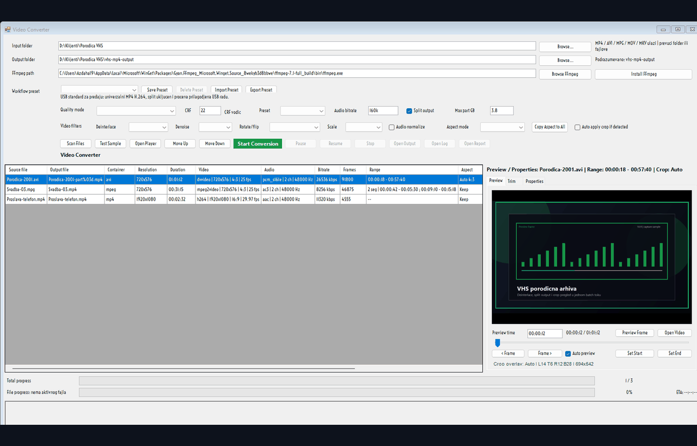
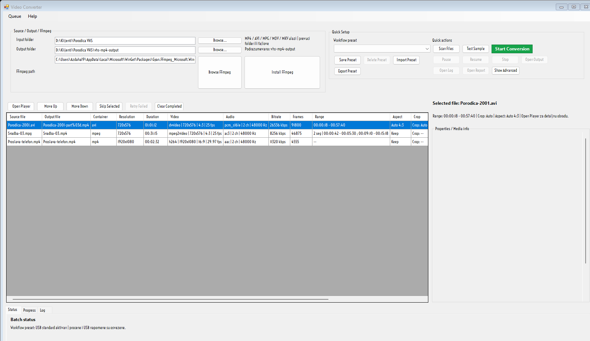
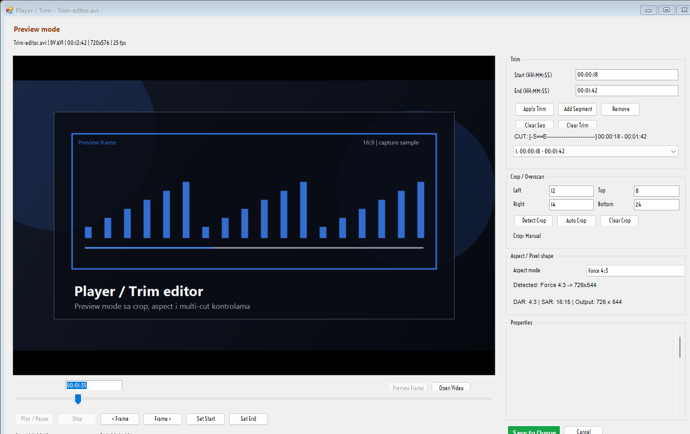
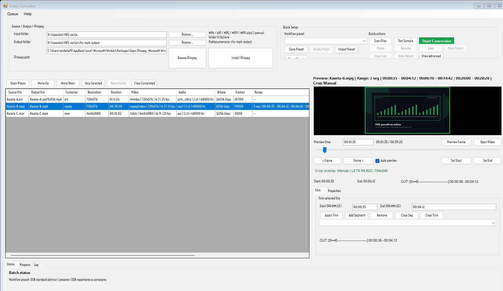

# VHS MP4 Optimizer

<div align="center">

Windows alat za konverziju, pregled, trim i pripremu video fajlova iz VHS, DVD, DV/MSDV i slicnih izvora.

[](https://github.com/joes021/vhs-mp4-optimizer/releases/latest)
[](https://github.com/joes021/vhs-mp4-optimizer/releases/latest)
[](https://learn.microsoft.com/powershell/)
[](https://ffmpeg.org/)
[](https://github.com/joes021/vhs-mp4-optimizer/releases)

</div>

> Napravljen za realan posao: velike DV AVI i VHS capture fajlove pretvara u manje, preglednije MP4 isporuke bez gubitka kontrole nad trimom, aspect-om, crop-om i USB ogranicenjima.

## Brzi linkovi

| Treba ti | Link |
| --- | --- |
| Najnoviji release | [GitHub Releases](https://github.com/joes021/vhs-mp4-optimizer/releases/latest) |
| Installer za Windows | [Latest release stranica](https://github.com/joes021/vhs-mp4-optimizer/releases/latest) |
| Portable paket | [Latest release stranica](https://github.com/joes021/vhs-mp4-optimizer/releases/latest) |
| Korisnicko uputstvo | [docs/VHS_MP4_OPTIMIZER_UPUTSTVO.md](docs/VHS_MP4_OPTIMIZER_UPUTSTVO.md) |
| Source repo | [joes021/vhs-mp4-optimizer](https://github.com/joes021/vhs-mp4-optimizer) |

Ako izadje noviji release, idi na [Releases](https://github.com/joes021/vhs-mp4-optimizer/releases/latest) stranu i preuzmi najnovije artefakte.

## Kako izgleda



<p align="center">
  
</p>

Glavni batch pogled: scan, queue, media info kolone, USB procena i properties pregled, bez stalno otvorenog preview editora.

<p align="center">
  
</p>

`Player / Trim` prozor: preview mode, timeline, multi-cut segmenti, crop/overscan i aspect korekcija po fajlu.

<p align="center">
  
</p>

Batch dorade: workflow preset, `Pause / Resume` tok i uredjivanje queued fajlova, dok se pravi preview/trim rad prebacuje u poseban floating editor.

## Sta ovaj alat radi

VHS MP4 Optimizer je lokalni Windows program za situacije kada dobijes:

- velike `DV AVI` ili `MSDV AVI` fajlove
- stare `MPG/MPEG` ili `VOB` exporte
- novije `MP4`, `MOV` ili `MKV` fajlove
- puno snimaka koje treba pripremiti za USB predaju ili arhivu

Umesto da se svaki fajl obradjuje rucno, alat pravi batch workflow sa pregledom, trimom, crop-om, aspect korekcijom, presetima i kontrolom velicine izlaza.

## Glavne mogucnosti

| Mogucnost | Sta dobijas |
| --- | --- |
| Batch scan i queue | Skeniranje foldera i podfoldera, bez upadanja u sopstveni output folder |
| Media info / properties | Kontejner, kodek, rezolucija, DAR/SAR, FPS, frejmovi, bitrate, audio detalji |
| Player / Trim prozor | Poseban prozor za pregled, timeline, trim i multi-cut rad po fajlu |
| Crop / Overscan | Auto detect + rucni crop za crne ivice i VHS overscan |
| Aspect / Pixel shape | `Auto`, `Keep Original`, `Force 4:3`, `Force 16:9` sa PAL/DV i NTSC/DV logikom |
| Workflow presets | Gotovi preset-i plus cuvanje sopstvenih batch podesavanja |
| Quick / Advanced raspored | Cist glavni ekran sa brzim batch tokom, properties pregledom i odvojenim naprednim parametrima |
| Split output | Deljenje dugackih fajlova na validne MP4 delove za FAT32/USB scenario |
| Pause / Resume | Pauza posle trenutnog fajla, pa nastavak od sledeceg queued reda |
| Queue alati | `Save Queue`, `Load Queue`, `Skip Selected`, `Retry Failed`, `Clear Completed`, `Move Up`, `Move Down` |
| Encode engine | `Auto`, `CPU (libx264/libx265)`, `NVIDIA NVENC`, `Intel QSV`, `AMD AMF` sa sigurnim fallback-om |
| Help / About / Updates | Vidljiva lokalna verzija, user guide i GitHub update provera sa potvrdom |
| Installer i portable build | `Setup.exe`, portable ZIP i release builder za deljenje drugima |

## Za koga je alat

Najvise smisla ima ako radis:

- VHS i miniDV digitalizaciju
- DVD i MPEG arhive
- masovnu pripremu snimaka za musterije
- predaju na USB gde velicina fajla pravi problem
- arhivske konverzije gde hoces pregled pre obrade

## Podrzani ulazi

Najcesci ulazni formati:

- `mp4`
- `avi`
- `mpg` / `mpeg`
- `mov`
- `mkv`
- `m4v`
- `wmv`
- `ts`
- `m2ts`
- `vob`

Program ume da radi i sa modernijim i sa starijim fajlovima, a kada playback nije moguc koristi stabilan `Preview mode` fallback za precizan trim i frame preview.

## Tipican workflow

1. Izaberes `Input folder`.
2. Kliknes `Scan Files`.
3. Pregledas `Properties`, procenu velicine i `USB note`.
4. U `Quick Setup` zoni radis svakodnevni batch tok, a `Show Advanced` otvara detaljne parametre tek kada zatrebaju.
5. Po potrebi otvoris `Open Player` za floating `Player / Trim` editor sa velikim preview-om, timeline-om i alatima sa strane.
6. Donji `Status / Progress / Log` tabovi daju pregled, dok batch prozor ostaje rasterecen od stalnog preview panela.
7. Ukljucis `Split output` ako isporuka ide na FAT32 ili zelis manje delove.
8. Po potrebi biras `Encode engine`: `Auto`, `CPU (libx264/libx265)`, `NVIDIA NVENC`, `Intel QSV` ili `AMD AMF`.
9. Po potrebi koristis `Queue` meni ili dugmad `Skip Selected`, `Retry Failed`, `Clear Completed`, `Save Queue` i `Load Queue`.
10. Pokrenes `Start Conversion`.
11. Dobijes gotove `mp4` fajlove i `IZVESTAJ.txt` u output folderu.
12. Po potrebi otvaras `Help -> About VHS MP4 Optimizer` ili `Help -> Check for Updates`.

## Izdvojene funkcije koje olaksavaju posao

### 1. Player / Trim

- `Play / Pause`, timeline i frame-by-frame kontrola
- `Set Start`, `Set End`, `Cut Segment`, `Remove`, `Clear Cuts`
- `Save to Queue` vraca izmene nazad u glavni batch bez posebnog exporta

### 2. Crop / Overscan

- `Detect Crop`
- `Auto Crop`
- rucna pixel polja `Left`, `Top`, `Right`, `Bottom`
- overlay koji pokazuje sta ce biti odseceno

### 3. Aspect / Pixel shape

- detekcija iz `DAR`, `SAR` i heuristike za PAL/DV i NTSC/DV
- square-pixel izlaz kada ima smisla
- rucni override kada je fajl pogresno flagovan

### 4. Workflow preset

Ugradjeni preset-i:

- `USB standard`
- `Mali fajl`
- `High quality arhiva`
- `HEVC manji fajl`
- `VHS cleanup`

Plus:

- `Save Preset`
- `Delete Preset`
- `Import Preset`
- `Export Preset`

### 5. Batch kontrola

- `Pause` zavrsava trenutni fajl pa staje
- `Resume` nastavlja od sledeceg queued reda
- `Move Up` i `Move Down` preslazu preostali batch
- `Skip Selected` odmah sklanja jedan queued fajl iz ove runde
- `Retry Failed` vraca neuspele fajlove nazad u queue
- `Clear Completed` cisti `done`, `skipped` i `stopped` stavke iz liste
- `Save Queue` i `Load Queue` cuvaju ceo batch plan sa trim/crop/aspect stanjem

### 6. Encode engine

- `Auto` ostavlja provereni CPU tok kao podrazumevani izbor
- `CPU (libx264/libx265)` daje najpredvidljiviji kvalitet i kompatibilnost
- `NVIDIA NVENC`, `Intel QSV` i `AMD AMF` su dostupni kada ih FFmpeg i masina stvarno podrzavaju
- ako hardware init ne uspe, alat bezbedno pada nazad na CPU umesto da prekine batch

## Preuzimanje i instalacija

### Opcija 1: Installer

1. Otvori [latest release](https://github.com/joes021/vhs-mp4-optimizer/releases/latest).
2. Preuzmi `Setup.exe`.
3. Pokreni instalaciju.
4. Po potrebi iz samog programa podesi `FFmpeg path` ili instaliraj FFmpeg.
5. Kada izadje nova verzija, dovoljno je da pokrenes novi `Setup.exe` preko postojece instalacije ili da iz programa kliknes `Help -> Check for Updates`.

### Opcija 2: Portable

1. Preuzmi `Portable ZIP`.
2. Raspakuj ceo folder.
3. Pokreni `VHS MP4 Optimizer.bat`.
4. Ako zelis, pokreni `Install Desktop Shortcut.bat`.
5. Nova verzija moze da se preuzme i iz samog programa preko `Help -> Check for Updates`; program prvo pita za potvrdu.

## Help i update

- `Help -> About VHS MP4 Optimizer` pokazuje `Current version`, `Release tag`, `Install type`, `Install path` i GitHub repo.
- `Help -> Open User Guide` otvara lokalno uputstvo iz release paketa.
- `Help -> Check for Updates` proverava poslednji GitHub release i pita pre preuzimanja update-a.
- Pri pokretanju program povremeno sam proveri da li postoji novija verzija, ali ne preuzima nista bez pitanja.

## FFmpeg napomena

Alat se oslanja na `ffmpeg.exe` i `ffprobe.exe`.

- Ako ih vec imas, samo pokazes putanju.
- Ako ih nemas, program nudi da instaliras ili pronadjes FFmpeg.
- Bez FFmpeg-a nema stvarne konverzije, preview frame-a ni detaljnog media info citanja.

## Antivirus / SmartScreen napomena

Posto je ovo unsigned Windows alat napravljen od PowerShell + batch + installer sloja, moguce je da neki antivirus ili SmartScreen trazi dodatnu potvrdu.

U novijem pakovanju su vec ublazeni najcesci heuristicki okidaci:

- installer ne ide u `Program Files`
- ne trazi admin privilegije po default-u
- launcher koristi blazi PowerShell policy za lokalno pokretanje

I dalje je moguc false positive na nekim sistemima, posebno kod agresivnijih AV paketa.

## USB i velicina fajla

Ako radis predaju na USB:

- `FAT32` ne voli fajlove vece od `4 GB`
- `exFAT` je bolji izbor za vece video fajlove
- `Split output` sa `3.8 GB` je praktican za siguran prolaz ispod limita

Program zato prikazuje procenu velicine i `USB note` pre nego sto pustis batch.

## Brzi start za razvoj

Pokretanje GUI-ja:

```powershell
powershell -NoProfile -ExecutionPolicy Bypass -File scripts/optimize-vhs-mp4-gui.ps1
```

Osvezavanje portable release foldera:

```powershell
powershell -NoProfile -ExecutionPolicy Bypass -File scripts/build-vhs-mp4-release.ps1
```

Pravljenje ZIP + installer paketa:

```powershell
powershell -NoProfile -ExecutionPolicy Bypass -File scripts/build-vhs-mp4-installer.ps1
```

Objava GitHub release-a:

```powershell
powershell -NoProfile -ExecutionPolicy Bypass -File scripts/publish-vhs-mp4-github-release.ps1
```

Osvezavanje README screenshot-a i GIF-a:

```powershell
powershell -NoProfile -STA -ExecutionPolicy Bypass -File scripts/build-readme-media.ps1
```

## Testiranje

Fokusirani regresioni paket:

```powershell
python -m pytest tests/test_optimize_vhs_mp4_core_behavior.py tests/test_optimize_vhs_mp4_gui_tokens.py tests/test_optimize_vhs_mp4_gui_launcher_tokens.py tests/test_vhs_release_package.py tests/test_vhs_installer_packaging.py -q
```

## Struktura repoa

- `scripts/` - GUI, core modul i builder skripte
- `assets/` - ikona i staticki resursi
- `release/` - spreman portable folder
- `dist/` - napravljeni release artefakti
- `packaging/` - Inno Setup skripta
- `tests/` - regresioni testovi
- `docs/` - korisnicko uputstvo, planovi i specifikacije

## Vazni dokumenti

- [Korisnicko uputstvo](docs/VHS_MP4_OPTIMIZER_UPUTSTVO.md)
- [Planovi i specifikacije](docs/superpowers/)

## Zasto je repo odvojen

Ovaj repozitorijum je namerno zaseban. Sadrzi samo ono sto pripada video konverteru i njegovom release/installer toku, bez mesanja sa drugim projektima.
